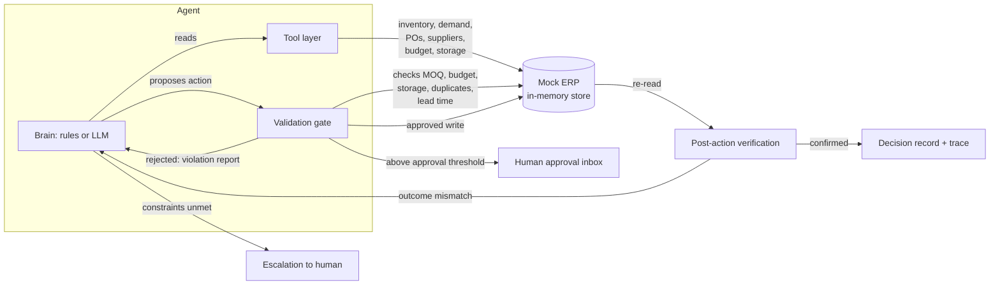

# AI Purchasing Agent

A full-stack AI Purchasing Agent that assists a retail buyer by investigating purchasing situations, making decisions, executing actions through a guarded action layer, and validating its own results.

**Author:** Saanvi Sarraf ([saanvi.sarraf.ug22@nsut.ac.in](mailto:saanvi.sarraf.ug22@nsut.ac.in)) · [GitHub](https://github.com/saanvi-211/ai-purchasing-agent) · [Live demo](https://ai-purchasing-agent-ct8l.onrender.com)

> **Note on the live demo:** hosted on Render's free tier, so the first request after a period of inactivity may take 30–60 seconds to wake the service. Subsequent requests are fast.

Instead of a chatbot that answers purchasing questions, this is a system that:

- **Investigates** — pulls inventory, demand, forecasts, open purchase orders, supplier terms, budget and storage from a mock ERP through a tool layer.
- **Decides** — applies an explicit decision framework: accept / modify / reject / investigate / escalate, with the factors and numbers behind the decision.
- **Acts** — creates, modifies or cancels purchase orders; escalates to a human when constraints or authority limits require it.
- **Validates** — every action passes an independent validation gate and a post-action verification step; failures are fed back to the agent, which adapts (retry with a different plan) or escalates.

The recommendation handed to the agent is treated as a hypothesis, never as a fact — the agent re-derives demand, coverage and constraints from ERP data before deciding anything.

---

## Quick start

```bash
npm install
npm run start          # backend + built frontend on http://localhost:8080
```

For development:

```bash
npm run dev:server     # backend on :8080
npm run dev            # frontend dev server (proxies /api to :8080)
```

Run the evaluation suite from the CLI:

```bash
npm run evaluate
```

**LLM configuration (optional).** The agent runs fully without any API key: a deterministic rule-based brain performs the identical investigate → decide → act → validate loop. To use an LLM instead, copy `.env.example` to `.env`, set `OPENAI_API_KEY` (and optionally `OPENAI_BASE_URL` and `OPENAI_MODEL` — any OpenAI-compatible provider works), restart, and pick the `llm` brain in the UI. In `auto` mode the LLM brain is used when configured. All required environment variables are documented in `.env.example`; no secrets are committed to the repository.

**Deploying.** This is a single, persistent Node/Express process (not a serverless function) — it needs a host that runs a long-lived server, such as Render, Railway, Fly.io, or a VM. It does not run correctly on Vercel's default serverless routing without restructuring the Express app as a serverless function and swapping the in-memory store for external state.

```bash
docker build -t purchasing-agent .
docker run -p 8080:8080 purchasing-agent
```

---

## Working demo

Run it in 60 seconds:

```bash
npm install
npm run start     # open http://localhost:8080
```

Or use the hosted version: **https://ai-purchasing-agent-ct8l.onrender.com**

Then in the UI:

1. **Workspace tab** → click a scenario in the left rail (Scenarios 1–4 are all implemented end-to-end).
2. Watch the agent trace live: the tool calls it makes (coverage projection, sales history, open POs, budget, storage), the factors it weighs, the action it takes, and the post-write verification.
3. The decision record shows the headline, quantified factors, actions taken and validation summary.
4. Purchase orders above roughly **$2,500** in order value are created in `pending_approval` state and land in the **Approval Inbox**, where the buyer can approve or reject them.
5. Open the **Evaluation** tab and click **Run evaluation** — 9 test scenarios with per-case scoring, or run `npm run evaluate` from the CLI.

---

## Architecture



**Key structural choice:** the agent never writes to the ERP directly. All mutations go through the validation gate, and the brains are interchangeable (`auto` / `llm` / `rules`) because both speak the same tool protocol.

---

## Scenarios implemented

| # | Scenario | What the agent does |
|---|---|---|
| 1 | **Purchase recommendation review** — system recommends buying 800 units | Recomputes coverage from demand, stock, open POs and safety stock, finds the real gap is ~180 units, modifies the order to 250 (supplier MOQ), validates budget/storage/MOQ, creates and verifies the PO |
| 2 | **Supplier cannot fulfil** — PO for 500u, only 250 supplied | Checks whether remaining supply still covers demand (in one variant it does → accept partial); otherwise sources the shortfall from a supplier that can deliver before the projected stockout day; if a supplier is blocked, retries with another and/or escalates |
| 3 | **Demand / forecast has changed** | Verifies the lift is sustained (≥3 of last 7 days above 1.2× forecast) vs a one-day anomaly; re-plans at the new run-rate, increases the inbound PO (or creates new supply), re-verifies coverage at the new demand |
| 4 | **Purchasing constraint** | Confirms the purchase is warranted, finds budget + storage make the recommended quantity infeasible, executes the largest feasible order, and escalates the remainder with a concrete proposed plan |

Every scenario run starts from a fresh, deterministic mock ERP, so runs are repeatable and the evaluation suite is stable.

---

## The feedback / validation loop (the core of the design)

The assignment asks how the system determines whether the agent's actions are actually acceptable, and what happens when the initial action does not work. Four mechanisms answer that:

### 1. Independent validation gate (before write)
`server/validator.js` re-derives every relevant fact from the ERP and rejects actions that would violate: supplier MOQ, supplier max order size, available budget (total − spent − committed to open POs), projected storage peak (on-hand + inbound + new), duplicate orders, and it flags lead-time risk when an order cannot arrive before the projected stockout day. The gate is not part of the agent's reasoning — the agent cannot bypass it.

### 2. Post-action verification (after write)
After a PO is written, the system re-reads it from the ERP and checks: does it exist, does the quantity/supplier match intent, is the budget still solvent after the write, is storage still within capacity, and — most importantly — does the expected outcome hold: a fresh coverage projection confirms the stockout was actually averted. If reality diverges from intent, the agent receives a failing verification report and must react.

### 3. Adaptive retry (when validation fails)
Rejected actions return a structured violation report which is fed back into the agent's context. The agent is instructed (and the rule brain is programmed) to never repeat a rejected action unchanged: it adapts by shrinking the quantity to fit the binding constraint, switching to a supplier that can deliver in time, or splitting the plan. Scenario 4's live trace demonstrates exactly this: an order is rejected twice on `budget_exceeded` at 180 units against two different suppliers, then the agent reduces the quantity to 127 units, which passes validation and is executed.

### 4. Human escalation and approval (when the agent shouldn't decide)
- **Escalation tool:** when constraints genuinely cannot be satisfied (e.g. Scenario 4), the agent escalates with a summary and a concrete proposed plan rather than forcing a bad action.
- **Approval threshold:** POs above roughly $2,500 in order value are created in `pending_approval` state and routed to the buyer's approval inbox in the UI. The agent reports this as a normal outcome, not a failure.

---

## How decisions are made

The decision framework forces the agent to choose exactly one of **accept / modify / reject / investigate / escalate** and to justify it with quantified factors. Before acting, the agent must verify:

- **Demand** — is the forecast stale? Is a spike sustained or a one-day anomaly?
- **Coverage** — on-hand − reservations + inbound vs demand over the horizon, relative to safety stock.
- **Existing POs** — would a new order duplicate incoming supply?
- **Supplier terms** — MOQ, capacity, lead time vs stockout date, price, reliability.
- **Budget headroom** and **storage headroom**.

The coverage simulator (`server/simulate.js`) projects stock day-by-day across the horizon, which gives every stage — recommendation review, what-if simulation, validation, and outcome verification — one shared, numeric definition of "is this plan actually good."

---

## Approach: breaking down the problem

The brief is deliberately ambiguous ("help a purchasing agent"). I broke it down as follows:

1. **What is the buyer's actual job?** Not answering questions — deciding whether/what/when to order, executing those orders in company systems, and being accountable for the outcome. So the deliverable is an agent that acts, not a chatbot.
2. **What information matters for one purchasing decision?** Demand (forecast + recent actuals), current coverage (on-hand − reservations + inbound vs demand, relative to safety stock), supplier terms (MOQ, capacity, lead time vs stockout date, price, reliability), budget headroom, and storage headroom. These became the agent's read tools.
3. **Where can an autonomous agent go wrong?** Trusting the incoming recommendation blindly, over-reacting to noise (one-day sales spikes), duplicating incoming supply, violating budget / storage / MOQ constraints, and repeating failed actions. Each failure mode got a specific countermeasure: hypothesis-testing the recommendation, sustained-lift evidence rules, duplicate guards, an independent validation gate, and adaptive retry.
4. **What does "acceptable" mean, arithmetically?** The coverage simulator — stock projected day-by-day across the horizon against safety stock — is the single shared definition used by the recommendation review, the what-if tool, the validation gate and the outcome verification.
5. **When should a human stay in the loop?** When the agent lacks authority (approval threshold) or when constraints genuinely cannot be satisfied (escalation with a concrete proposed plan) — rather than forcing a bad action.

---

## Supporting services and mock data

Everything needed to run the application is inside the repository — there are no external dependencies beyond Node.js:

- **Mock ERP** (`server/seed.js`, `server/store.js`): products, on-hand/reserved inventory, safety stock, 28 days of daily sales (actual vs forecast), demand forecasts, three suppliers with differing lead times / MOQs / prices / reliability, open purchase orders, a monthly purchasing budget, and warehouse storage capacity. Seeded deterministically; each scenario run rebuilds it from scratch, so runs are repeatable.
- **Mock agent-facing API** (REST + SSE, `server/index.js`): `GET /api/state`, `GET /api/scenarios`, `POST /api/agent/run` (streams the agent's trace events), `GET /api/evaluation/run`, `POST /api/approvals/:poId/:action` — the same endpoints the UI uses.
- **Simulated system events:** incoming recommendations, supplier shortfall messages and demand alerts, which the agent must interpret and act on.

In a real deployment, the store layer is the single swap point for a database, and the tool layer is where real ERP APIs would plug in.

---

## Evaluation approach

`npm run evaluate` (or the Evaluation tab) runs 9 test scenarios against the deterministic rule brain — the four assignment scenarios plus five edge cases designed to catch the classic failure modes:

| Case | Tests |
|---|---|
| S1: 800u recommendation vs ~180u gap | over-recommendation is corrected down |
| S1b: recommendation already correct (250u) | a good recommendation is accepted and executed, not second-guessed |
| S1c: warehouse already full | no purchase is made when coverage is sufficient → reject |
| S2: 250/500 partial supply | shortfall is re-sourced before the stockout date |
| S2b: inventory already covers the shortfall | partial delivery accepted, no unnecessary spend |
| S2c: primary supplier blocked | validator rejects the order → agent recovers via another supplier |
| S3: sustained demand lift (+53%) | purchase plan increased at the new run-rate |
| S3b: one-day sales spike | agent investigates instead of re-ordering on an anomaly |
| S4: budget + storage constraints | feasible part executed within constraints, remainder escalated |

Each case is scored on five criteria (mirroring the assignment's evaluation questions):

1. **Decision correctness** — right decision type for the situation.
2. **Information gathering** — did the agent actually consult the relevant data (tools used)?
3. **Constraint respect** — re-derived from the final world state: no PO exceeds budget, storage capacity, or supplier MOQ/capacity.
4. **Appropriate action** — the world ends up in the intended state (right POs created/modified/not created).
5. **Result validation** — actions were verified after writing, and rejections triggered recovery.

Running the LLM brain against the same suite is the intended next step: the rule brain provides the deterministic ground truth, and any LLM decision that diverges from a passing case can be inspected via its full trace.

---

## Project structure

```
server/
  index.js            Express app: REST API, SSE agent stream, static frontend
  seed.js             Deterministic mock-ERP seed (products, suppliers, POs, budget, storage)
  store.js            In-memory ERP state + mutations (swap point for a real database)
  simulate.js         Day-by-day coverage projection / what-if simulation
  tools.js            Tool layer: read tools + validation-gated action tools (+ LLM schemas)
  validator.js        Independent validation gate + post-action verification
  scenarios.js        The four scenarios (task + deterministic world overlay)
  evaluation.js       9-case evaluation harness with per-criterion checks
  agent/
    run.js            Orchestrator: fresh world → brain → trace events → outcome check
    prompt.js         System prompt + strict decision-output contract
    llmBrain.js       OpenAI-compatible tool-calling loop
    llm.js             Provider-agnostic LLM client (base URL configurable)
    ruleBrain.js       Deterministic analyst (runs without any API key)
src/                  React dashboard (scenarios, live trace, decisions, approvals, evaluation)
```

---

## Design decisions worth noting

- **Mock ERP behind a narrow store API.** The whole system only touches state through `store.js` functions, so replacing the in-memory store with a real database touches one file.
- **Rule brain as first-class citizen.** It is not a stub: it is the evaluation baseline, the no-API-key demo mode, and an executable specification of the intended policy.
- **Numbers over vibes.** Decisions, factors, validations and evaluation checks all quote the actual computed quantities (gap to safety stock, days to stockout, budget headroom), so a reviewer can audit any decision arithmetically.
- **Traceability.** Every run streams a complete trace — tool calls, rejections, verifications — which doubles as the audit log for the buyer.

---

## Additional buyer problems the same agent / architecture can solve

The same tool layer, validation gate and feedback loop extend to neighbouring buyer problems demonstrated here in embryo, and solved in full with more data:

- **Open purchase order follow-ups** — the agent already reads open POs; with delivery-status events it can chase late deliveries and re-plan around them (the shortfall scenario is the same mechanism).
- **Supplier reliability** — reliability scores are already in the data model and used in sourcing order; with a delivery history it can penalise late suppliers and split orders to hedge.
- **Alternate suppliers** — sourcing already switches suppliers when the primary is blocked or misses the stockout date (Scenario 2 and the recovery evaluation case); a wider supplier list makes this a general capability.
- **Promotional buying** — promotion calendars are just another demand modifier feeding the coverage simulator, the same slot where the demand-surge evidence rule sits.
- **Forecast anomalies** — the sustained-lift vs one-day-anomaly evidence rule (Scenario 3) is a general forecast-anomaly detector; thresholds could be per-SKU.
- **Replenishment and safety stock** — the core loop already computes replenishment quantities to a safety-stock target; per-SKU service levels would make safety stock dynamic.
- **Seasonal demand** — seasonal profiles are demand curves over the same horizon; the simulator needs no structural change, only per-day demand instead of flat per-day demand.
- **Approval workflow expansion** — approving large modifications, and approval queues with multiple buyers, reuse the same human-in-the-loop path.

---

## Assignment coverage map

| Submission requirement | Where |
|---|---|
| Complete source code | this repository (`server/`, `src/`, configs) |
| README with setup and run instructions | [Quick start](#quick-start) |
| Working demo | [Working demo](#working-demo) |
| Architecture diagram | [Architecture](#architecture) |
| Description of approach | [Approach: breaking down the problem](#approach-breaking-down-the-problem) |
| Test scenarios and evaluation approach | [Scenarios implemented](#scenarios-implemented), [Evaluation approach](#evaluation-approach) |
| Mock APIs, datasets, supporting services | [Supporting services and mock data](#supporting-services-and-mock-data) |
| How the agent's decisions are validated | [The feedback / validation loop](#the-feedback--validation-loop-the-core-of-the-design) |
| `.env.example` for required variables | `.env.example` (documented in Quick start) |
| No secrets committed | `.env` is gitignored; `.env.example` contains only empty variables |
| Intact Git commit history | full history preserved in this repository |

---

## Contact

**Saanvi Sarraf** — [saanvi.sarraf.ug22@nsut.ac.in](mailto:saanvi.sarraf.ug22@nsut.ac.in) · [GitHub](https://github.com/saanvi-211) · [LinkedIn](https://linkedin.com/in/saanvi-sarraf-4a3503263) · [Portfolio](https://saanvisarraf.netlify.app)
